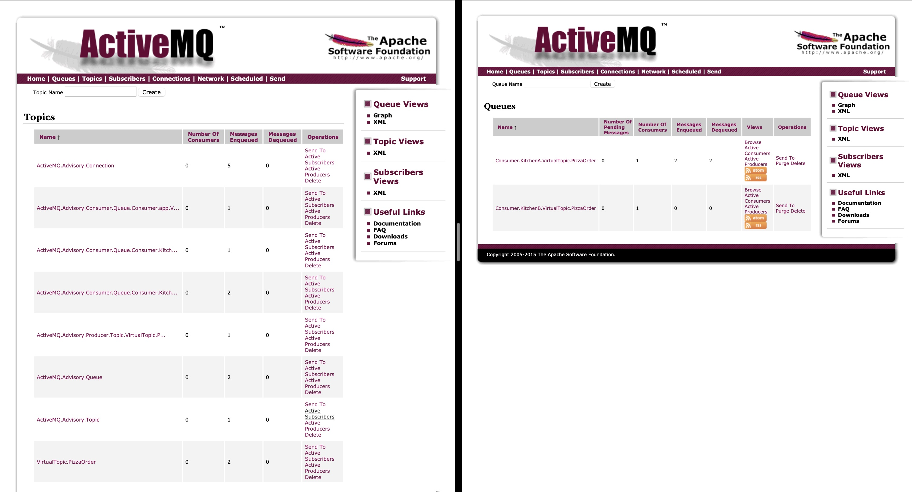

### How to run

In the current directory run 
`docker-compose up --build`

To add a message to the order topic run 
`curl -X POST http://localhost:8081/order -H "Content-Type: application/json" -d '{
"dishName": "meatballs",
"specialPreferences": "with BBQ souse"
}'
`

There were created virtual topic. Subscribers connected to queue associated with the topic
